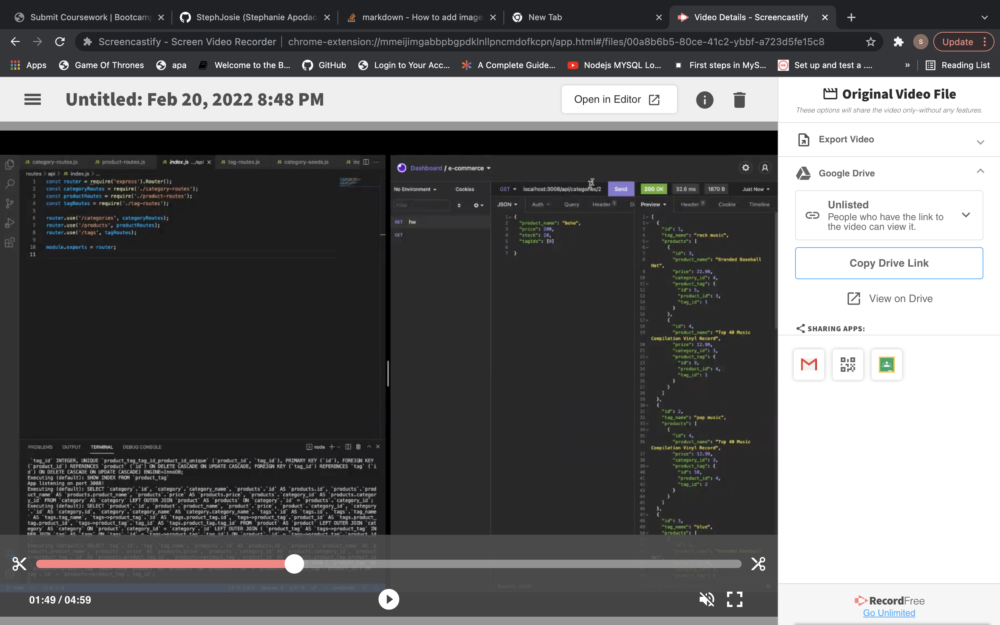

# e-commerce

Shows how Insomnia works on an e-commerce db

## Description

e-commerce backend using insomnia to show get, post, put, and delete

### Dependencies

* nodemon
* npm
* mysql
* sequelize
* express
* dotenv

### Executing program

## Authors

Stephanie Apodaca
https://github.com/StephJosie

